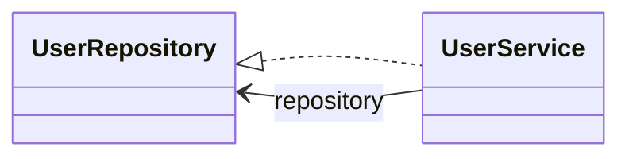

# ClassDiagramMaker

C# source analyzer for generating Mermaid class diagrams from selected files and directories.

## Requirements

- .NET SDK 9.0

The repository includes `global.json` to use the .NET 9 SDK even when newer SDKs are installed.

## Run

```bash
dotnet restore
dotnet run --project src/ClassDiagramMaker/ClassDiagramMaker.csproj
```

Open the URL printed by `dotnet run`, then fill in:

- Target project folder
- Search folder
- Search file, optional
- Output path for the generated `.mmd` file

When the search file is empty, the tool recursively analyzes `.cs` files under the search folder. The GUI shows parsing and rendering progress while the Mermaid file is generated.

## Output

The first supported output format is Mermaid `classDiagram`.



## Bootstrap

For users who cannot download the repository, this project provides a generated single-file bootstrap script:

```bash
./bootstrap/ClassDiagramMaker.bootstrap.sh ./ClassDiagramMaker
```

The script recreates the source tree locally. Regenerate it after source changes with:

```bash
./tools/generate-bootstrap.sh
```
