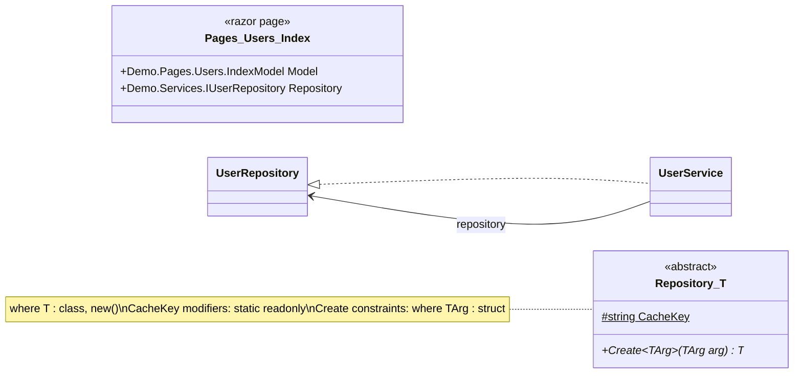

# ClassDiagramMaker

指定した C# のファイルやディレクトリを解析し、Mermaid または Excel のクラス図を生成するツールです。

GUI は Windows 向けの WinForms アプリケーションです。

## 必要環境

- .NET SDK 9.0
- WinForms GUI を実行する場合は Windows

このリポジトリには `global.json` が含まれているため、新しい SDK がインストールされている環境でも .NET 9 SDK を使用します。

## 実行方法

PowerShell では次のように実行します。

```powershell
dotnet restore src/ClassDiagramMaker/ClassDiagramMaker.csproj
dotnet run --project src/ClassDiagramMaker/ClassDiagramMaker.csproj
```

WinForms 画面で次の項目を指定します。

- 対象プロジェクト `.csproj`
- 検索対象フォルダ、任意
- 検索対象ファイル、任意
- 生成する `.mmd` または `.xlsx` ファイルの出力先

検索対象ファイルが空の場合は、検索対象フォルダ配下の `.cs`、`.cshtml.cs`、`.cshtml` ファイルを再帰的に解析します。検索対象フォルダも空の場合は、`.csproj` のあるフォルダを基準に解析します。GUI では解析中とレンダリング中の進捗を確認できます。

## 表示オプション

GUI では巨大なプロジェクトでも見やすくするため、出力内容を調整できます。

- 表示モード: 型だけ、主要メンバー、全メンバー
- 関係線: 継承、interface 実装、フィールド/プロパティ関連、メソッド依存を個別に切り替え
- 出力形式: Mermaid `.mmd`、Excel `.xlsx`
- 検索対象ファイル指定時または分割出力時: 関連型も表示、関連の深さ、無制限、関連型は使用メンバーのみを切り替え
- 分割出力: Mermaid は 1 クラス 1 ファイル、Excel は 1 クラス 1 シートで出力

検索対象ファイルを指定して「関連型も表示」を有効にすると、`.csproj` 配下の型を解析したうえで、選択ファイル内の型を起点に関係線で関連型を辿ります。深さ `0` は選択ファイル内の型のみ、深さ `1` は直接関連する型まで、深さ `2` は関連先からさらに直接関連する型までを出力します。「無制限」を有効にすると、プロジェクト内で辿れる関連型をすべて出力します。

分割出力時も同じ深さ設定を使います。深さ `0` は対象クラスだけ、深さ `1` は対象クラスと直接関連クラス、深さ `2` は直接関連クラスの関連先までを各ファイルまたは各シートに含めます。全体図が必要な場合は分割出力をオフにします。

「関連型は使用メンバーのみ」を有効にすると、選択ファイル自身の型は通常の表示モードに従い、関連型のメンバーだけを選択ファイルから実際に参照されたメソッド、プロパティ、フィールド、イベント、コンストラクタに絞ります。関連型の使用メンバーがさらに別のメンバーを呼び出す場合は、そのメンバーも辿って残します。

## Razor 対応

Razor の `.cshtml` ファイルは Razor ページのノードとして表現されます。解析対象は次の要素です。

- `@model`
- `@inject`
- `@functions` / `@code` ブロックに定義されたメンバー
- マークアップ内の tag helper、view component、partial view 参照

`.cshtml.cs` の code-behind ファイルは通常の C# ソースとして解析します。

単一の Razor ファイルを指定した場合は、対応するペアも一緒に解析します。

- `Page.cshtml` を選択すると、存在する場合は `Page.cshtml.cs` も解析します。
- `Page.cshtml.cs` を選択すると、存在する場合は `Page.cshtml` も解析します。

## テスト

Core の解析処理は xUnit でテストしています。

```bash
dotnet test ClassDiagramMaker.sln
```

## リリース

PowerShell で Windows 用の単一 exe を生成できます。

```powershell
./tools/publish-single-exe.ps1
```

既定の出力先は次の通りです。

```text
artifacts/win-x64-single-file/ClassDiagramMaker.exe
```

起動に失敗した場合は、エラーダイアログを表示し、次のログファイルに詳細を書き込みます。

```text
%LOCALAPPDATA%\ClassDiagramMaker\ClassDiagramMaker.error.log
```

別の Windows runtime 向けに publish する場合は、`-Runtime` を指定します。

```powershell
./tools/publish-single-exe.ps1 -Runtime win-arm64
./tools/publish-single-exe.ps1 -Runtime win-x86
```

同等の `dotnet publish` コマンドは次の通りです。

```bash
dotnet publish src/ClassDiagramMaker/ClassDiagramMaker.csproj -c Release -r win-x64 --self-contained true -p:PublishSingleFile=true -p:IncludeNativeLibrariesForSelfExtract=true -p:PublishTrimmed=false -p:DebugType=none -p:DebugSymbols=false -p:CopyOutputSymbolsToPublishDirectory=false -o artifacts/win-x64-single-file
```

publish profile `win-x64-single-file` も利用できます。

```bash
dotnet publish src/ClassDiagramMaker/ClassDiagramMaker.csproj -p:PublishProfile=win-x64-single-file
```

## 分割出力

Mermaid で分割出力を有効にすると、指定した出力先のファイル名がプレフィックスとして使われ、1 クラスごとに `.mmd` を生成します。
たとえば `diagram.mmd` を指定すると、次のようなファイルを生成できます。

```text
diagram.index.md
diagram.Demo.Services.UserService.mmd
diagram.Demo.Services.UserRepository.mmd
diagram.Demo.Models.UserDto.mmd
```

`diagram.index.md` は任意で生成できます。分割出力では全体図ファイルは生成しません。全体図を確認する場合は分割出力をオフにしてください。

Excel で分割出力を有効にすると、1 つの `.xlsx` 内に 1 クラス 1 シートで出力します。分割出力をオフにした場合は、1 つの `.xlsx` に `ClassDiagram` シートだけを作成します。

分割された図では、対象クラスと関連深さオプションで辿った型、およびその範囲内で両端の型が存在する関係だけを出力します。

## 解析できる依存関係

C# ソースは Roslyn の AST と SemanticModel を使って解析します。主な取得対象は次の通りです。

- 継承、interface 実装、フィールド、プロパティ、イベント、メソッド、コンストラクタ、インデクサ
- `abstract`、`sealed`、`static`、`readonly` などの修飾子
- generic 型引数、`where T : class` などの generic 制約
- 属性、`typeof(...)`、base 型の generic 引数
- メソッド本体内の `new`、cast、pattern matching、`var` 推論型、static メンバー呼び出し、generic メソッド型引数、呼び出し先の戻り値型
- メソッド本体内のメソッド、プロパティ、フィールド、イベント、コンストラクタ参照
- `using static` と using alias 経由で参照した型
- delegate と class primary constructor

## 出力形式

Mermaid の `classDiagram` と Excel `.xlsx` に対応しています。



Excel 出力では、同じ解析結果を 1 シート内に次の構造で配置します。

- Diagram: クラスブロック
- Types: 型一覧
- Members: メンバー一覧
- Relationships: 関係一覧
- Mermaid: 同じ範囲の Mermaid テキスト

Excel 分割出力では、この構造を 1 クラス 1 シートで作成します。

## Bootstrap

リポジトリをダウンロードできないユーザー向けに、単一ファイルの bootstrap スクリプトを用意しています。

Windows / PowerShell では次のコマンドを使います。

```powershell
powershell -ExecutionPolicy Bypass -File .\bootstrap\ClassDiagramMaker.bootstrap.ps1 .\ClassDiagramMaker
```

PowerShell の実行ポリシーでブロックされない環境では、次のように直接実行できます。

```powershell
.\bootstrap\ClassDiagramMaker.bootstrap.ps1 .\ClassDiagramMaker
```

macOS / Linux など `sh` が使える環境では、次のコマンドでも生成できます。

```bash
sh ./bootstrap/ClassDiagramMaker.bootstrap.sh ./ClassDiagramMaker
```

生成後、Windows では次のように起動または publish できます。

```powershell
cd .\ClassDiagramMaker
dotnet run --project .\src\ClassDiagramMaker\ClassDiagramMaker.csproj
.\tools\publish-single-exe.ps1
```

このスクリプトはアプリ本体と Core のソースツリーをローカルに再作成します。xUnit のテストコードは意図的に含めていません。

ソース変更後に bootstrap を再生成する場合は、次のコマンドを実行します。

```bash
./tools/generate-bootstrap.sh
```
